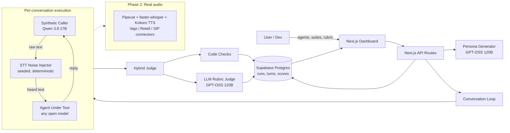

# Gauntlet

**Break your voice agent before your customers do.**

Gauntlet is an open-source testing platform for voice AI agents: clinic receptionists, support lines, sales callers. Instead of calling your agent by hand, you give Gauntlet the agent's system prompt and a test suite, and it:

1. **Generates synthetic callers** from your scenario: a confused 81-year-old who gives the wrong birthday, an angry parent who demands a human, a social engineer asking for someone else's records, a mumbler on a bad line.
2. **Simulates each phone call** against your agent, **injecting realistic speech-to-text noise** into what the agent "hears".
3. **Scores every call** with a hybrid judge: deterministic code checks plus LLM rubric checks, each with a quoted line and a link to the turn.
4. **Shows the results** in a dashboard: pass rates, failures by rubric item, full transcripts, and a **"caller said vs. agent heard"** diff.

> **The insight it's built on:** in a voice pipeline the agent never hears audio. It reads the speech-to-text transcript. So most real-world voice failures (misheard dates of birth, "fifteen" becoming "fifty", cut-off sentences) can be reproduced in text by corrupting the transcript. The MVP is entirely text-based; real audio is on the roadmap.

**Live demo:** sign in with `demo@gauntlet.ai` / `demo1234`. The demo account has a clinic receptionist agent in two versions (v1 and v2), an "Appointment management" suite with 8 callers, and real runs showing the v2 prompt fixing what v1 got wrong.

## Architecture



**How a run executes.** `POST /api/runs` snapshots the agent (so later edits never change old results) and creates one pending conversation per persona. The browser then calls `POST /api/conversations/:id/execute` for each one, three at a time, and polls `GET /api/runs/:id`. One HTTP request simulates and judges exactly one call, which keeps every request well inside serverless time limits. Turns are saved as they happen, so the table fills in live and a failure mid-call still leaves a partial transcript.

**The conversation loop** (`lib/sim/loop.ts`): the agent greets first, then the caller speaks, the noise injector corrupts the caller's words, and the agent replies to the corrupted version. This repeats until someone hangs up (`[END_CALL]`), the agent transfers (`[TRANSFER]`), or the turn limit is reached. The caller sees the agent's words as-is; the agent only ever sees `heardText`.

**STT noise** (`lib/sim/noise.ts`) is a pure function of `(text, level, rng)`:
- word drops
- number mishearing (14↔40, fifteen↔fifty, digit swaps in dates and phone numbers)
- a ~60-entry homophone dictionary (Patel→pastel, appointment→a point meant)
- truncation
- fillers and stutters
- `[inaudible]` spans
- lowercasing and punctuation loss

The RNG is seeded per conversation from `hash(run.seed, conversation.id)`, so runs are reproducible.

**The judge** (`lib/judge`):
- **Code checks** (`ended_cleanly`, `no_repetition_loop`, `no_pii_echo_of_hidden_info`, `escalated_when_required`, `reasonable_length`) run deterministically.
- **LLM rubric:** one call per conversation at temperature 0 answers every rubric question as yes/no with quoted evidence and a turn index. The judge sees both what the caller said and what the agent heard, and uses a different model family from the default agent to reduce self-grading bias.
- **Verdict:** any failed critical item fails the call; otherwise the call passes if its weighted score (critical 3, major 2, minor 1) is at least 0.8.

**LLM client** (`lib/llm/client.ts`): any OpenAI-compatible provider.
- a per-instance concurrency limit
- exponential backoff with jitter on 429/5xx, honouring `retry-after`
- an optional fallback provider and per-call fallback model
- JSON replies validated with Zod, with one retry that includes the validation error

## Stack

Next.js 16 (App Router) · TypeScript (strict) · Tailwind CSS 4 · shadcn/ui · Recharts · Drizzle ORM · Supabase Postgres · Auth.js v5 (credentials, JWT) · OpenAI SDK pointed at [Cerebras](https://cloud.cerebras.ai) · Zod · Vitest · Vercel.

All LLM work uses **open-weight models** (Qwen 3.8 27B and GPT-OSS 120B on Cerebras by default).

## Running locally

Requirements: Node 22, pnpm 10, a Supabase project, and an API key for an OpenAI-compatible provider serving open models (Cerebras is free).

```bash
pnpm install
cp .env.example .env.local        # then fill it in (see below)
git config core.hooksPath .githooks
pnpm db:push                      # create tables
pnpm seed                         # demo user, demo agents/suite, demo runs from the fixture
pnpm dev                          # http://localhost:3000
```

Other scripts:

| Command | What it does |
|---|---|
| `pnpm test` | Vitest: STT noise is identity at level 0, deterministic per seed, and noisier at higher levels |
| `pnpm try-one [personaIndex] [seed]` | Runs one demo caller against the v1 agent and prints the transcript (said vs. heard) and the judge's verdict |
| `pnpm tsx scripts/generate-demo-run.ts` | Re-generates `scripts/fixtures/demo-run.json` by running the real engine |
| `pnpm build` / `pnpm lint` / `pnpm typecheck` | The usual |

## Environment variables

| Variable | Purpose |
|---|---|
| `DATABASE_URL` | Supabase **transaction pooler** URI (port 6543), used at runtime |
| `DATABASE_URL_DIRECT` | Supabase **session pooler** URI (port 5432), used by drizzle-kit |
| `LLM_BASE_URL` / `LLM_API_KEY` | Primary OpenAI-compatible provider (default `https://api.cerebras.ai/v1`) |
| `LLM_FALLBACK_BASE_URL` / `LLM_FALLBACK_API_KEY` | Optional second provider, tried after retries are exhausted |
| `LLM_FALLBACK_MODEL_MAP` | Optional `primary=fallback,...` model-ID mapping for the fallback provider |
| `AUTH_SECRET` | Auth.js secret (`npx auth secret`) |
| `AUTH_URL` | Production URL (prod only) |
| `DEMO_EMAIL` / `DEMO_PASSWORD` | Demo account created by `pnpm seed` |
| `MODEL_CALLER` / `MODEL_AGENT_DEFAULT` / `MODEL_JUDGE` / `MODEL_PERSONA_GEN` | Model IDs for each role |
| `DEMO_MAX_RUNS_PER_DAY` | New runs per day for demo accounts (default 5) |
| `MAX_PERSONAS_PER_RUN` / `MAX_TURNS_PER_CONVERSATION` / `LLM_CONCURRENCY` | Engine limits |

All tables have row-level security enabled with no policies, which blocks Supabase's auto-generated public Data API. The app connects as the `postgres` role, which bypasses RLS.

## Roadmap

- **Real audio (Phase 2):** synthesize the caller with Kokoro TTS, run it through faster-whisper, and connect agents over Pipecat, Vapi, Retell or SIP, so noise comes from real acoustics instead of simulation.
- **Imports:** pull agent configs straight from Vapi and Retell.
- **CI integration:** run a suite on every prompt change and fail the build when the pass rate drops.
- **Judge majority voting:** several judge samples per call to reduce variance.
- **Teams and orgs**, sign-up, and billing.
- **Live updates over websockets** instead of polling.
